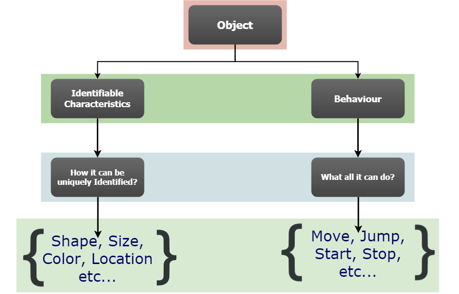
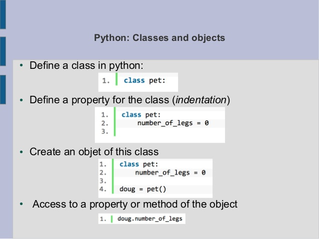
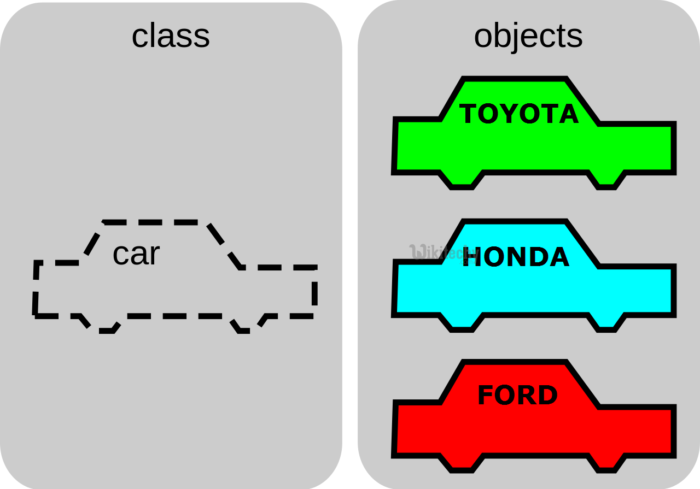
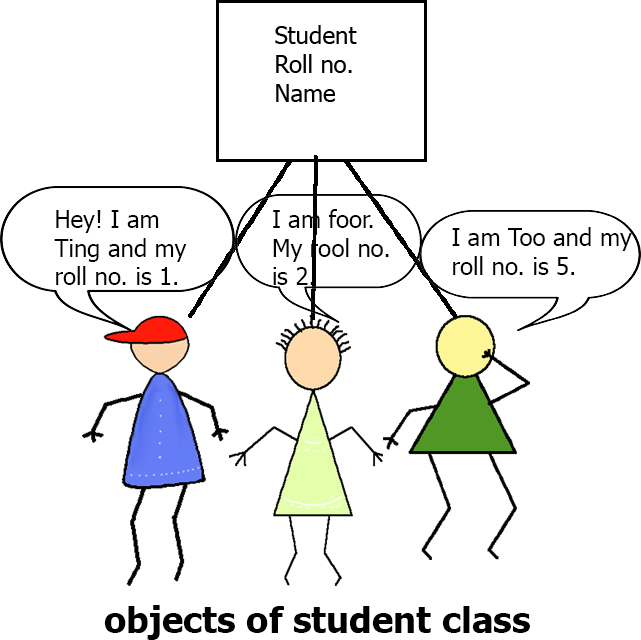

# Week 5
Python Functions, Modules, Packages, Classes

## Chapter 8. Functions
In this chapter you’ll learn to write functions, which are named blocks of code that are designed to do one specific job. When you want to perform a particular task that you’ve defined in a function, you call the name of the function responsible for it. If you need to perform that task multiple times throughout your program, you don’t need to type all the code for the same task again and again; you just call the function dedicated to handling that task, and the call tells Python to run the code inside the function. You’ll find that using functions makes your programs easier to write, read, test, and fix.

### Defining a Function
Here’s a simple function named greet_user() that prints a greeting:
 ```python
def greet_user():
    """Display a simple greeting."""
    print("Hello!")

greet_user()
```

### Passing Information to a Function
The function now expects you to provide a value for username each time you call it. When you call greet_user(), you can pass it a name, such as 'jesse', inside the parentheses:

```python
def greet_user(username):
    """Display a simple greeting."""
    print(f"Hello, {username.title()}!")

greet_user('jesse')
```


### Positional Arguments
When you call a function, Python must match each argument in the function call with a parameter in the function definition. The simplest way to do this is based on the order of the arguments provided. Values matched up this way are called positional arguments.

```python
def describe_pet(animal_type, pet_name):
    """Display information about a pet."""
    print("\nI have a " + animal_type + ".")
    print("My " + animal_type + "'s name is " + pet_name.title() + ".")

describe_pet('hamster', 'harry')
# I have a hamster.
# My hamster's name is Harry.
```

### Multiple Function Calls
You can call a function as many times as needed. Describing a second, different pet requires just one more call to describe_pet():
```python
def describe_pet(animal_type, pet_name):
    """Display information about a pet."""
    print("\nI have a " + animal_type + ".")
    print("My " + animal_type + "'s name is " + pet_name.title() + ".")

describe_pet('hamster', 'harry') # order matter in Positional Arguments
describe_pet('dog', 'willie')
```
### Keyword Arguments
A keyword argument is a name-value pair that you pass to a function. You directly associate the name and the value within the argument, so when you pass the argument to the function, there’s no confusion (you won’t end up with a harry named Hamster). Keyword arguments free you from having to worry about correctly ordering your arguments in the function call, and they clarify the role of each value in the function call. Let’s rewrite pets.py using keyword arguments to call describe_pet(): 
```python
def describe_pet(animal_type, pet_name):
    """Display information about a pet."""
    print("\nI have a " + animal_type + ".")
    print("My " + animal_type + "'s name is " + pet_name.title() + ".")

describe_pet(animal_type='hamster', pet_name='harry')
```
### Default Values
When writing a function, you can define a default value for each parameter. If an argument for a parameter is provided in the function call, Python uses the argument value. If not, it uses the parameter’s default value.

For example, if you notice that most of the calls to describe_pet() are being used to describe dogs, you can set the default value of animal_type to 'dog'. Now anyone calling describe_pet() for a dog can omit that information: 
```python
def describe_pet(pet_name, animal_type='dog'):
    """Display information about a pet."""
    print("\nI have a " + animal_type + ".")
    print("My " + animal_type + "'s name is " + pet_name.title() + ".")

describe_pet(pet_name='willie')

# I have a dog.
# My dog's name is Willie.
```
### Equivalent Function Calls
Because positional arguments, keyword arguments, and default values can
all be used together, often you’ll have several equivalent ways to call a function.

All of the following calls would work for this function:
```python
# A dog named Willie.
describe_pet('willie')
describe_pet(pet_name='willie')
# A hamster named Harry.
describe_pet('harry', 'hamster')
describe_pet(pet_name='harry', animal_type='hamster')
describe_pet(animal_type='hamster', pet_name='harry')
```
Each of these function calls would have the same output as the previous examples. 

*Note: It doesn’t really matter which calling style you use. As long as your function calls produce the output you want, just use the style you find easiest to understand.*

## Avoiding Argument Errors
When you start to use functions, don’t be surprised if you encounter errors about unmatched arguments. Unmatched arguments occur when you provide fewer or more arguments than a function needs to do its work.


### Return Values
A function doesn’t always have to display its output directly. Instead, it can process some data and then return a value or set of values. The value the function returns is called a return value. The return statement takes a value from inside a function and sends it back to the line that called the function. Return values allow you to move much of your program’s grunt work into functions, which can simplify the body of your program. 

### Returning a Simple Value
Let’s look at a function that takes a first and last name, and returns a neatly formatted full name:
```python
# formatted_name.py
def get_formatted_name(first_name, last_name):      # 1.
    """Return a full name, neatly formatted."""
    full_name = first_name + ' ' + last_name        # 2.
    return full_name.title()                        # 3.

musician = get_formatted_name('jimi', 'hendrix')    # 4.
print(musician)


```
The definition of get_formatted_name() takes as parameters a first and last name (1.) The function combines these two names, adds a space between them, and stores the result in full_name (2.) The value of full_name is converted to title case, and then returned to the calling line at (3.) w.When you call a function that returns a value, you need to provide a variable where the return value can be stored. In this case, the returned value is stored in the variable musician at (4.) The output shows a neatly formatted name made up of the parts of a person’s name:

    Jimi Hendrix


The **break** statement offers a straightforward way to exit the loop


```python
def find_num(num_list, number):
    for num in num_list:
        if num == number:
            print(f"{number} is found!!")
            break   # exits the loop as soon as first match to 'number' is found from 'num_list'


nums = [5, 55, 76, 1, -9, 0, 1, 456]
find_num(nums, 1)
find_num([45, 0, 'hello'], 7)
```


### Passing an Arbitrary Number of Arguments
Sometimes you won’t know ahead of time how many arguments a function needs to accept. Fortunately, Python allows a function to collect an arbitrary number of arguments from the calling statement. For example, consider a function that builds a pizza. It needs to accept a number of toppings, but you can’t know ahead of time how many toppings a person will want. The function in the following example has one parameter, *toppings, but this parameter collects as many arguments as the calling line provides:

```python
# pizza.py 
def make_pizza(*toppings):
    """Summarize the pizza we are about to make."""
    print("\nMaking a pizza with the following toppings:")
    for topping in toppings:
        print("- " + topping)

make_pizza('pepperoni')
make_pizza('mushrooms', 'green peppers', 'extra cheese')
```
The asterisk in the parameter name *toppings tells Python to make an empty tuple called toppings and pack whatever values it receives into this tuple. The print statement in the function body produces output showing that Python can handle a function call with one value and a call with three values. It treats the different calls similarly. Note that Python packs the arguments into a tuple, even if the function receives only one value:
    
    Making a pizza with the following toppings:
    - pepperoni
    Making a pizza with the following toppings:
    - mushrooms
    - green peppers
    - extra cheese

### Importing an Entire Module
To start importing functions, we first need to create a module. A module is a file ending in .py that contains the code you want to import into your program. Let’s make a module that contains the function make_pizza(). To make this module, we’ll remove everything from the file pizza.py except the function make_pizza().

Now we’ll make a separate file called making_pizzas.py in the same directory as pizza.py. This file imports the module we just created and then makes two calls to make_pizza(): 
```python
# making_pizzas.py
import pizza

pizza.make_pizza(16, 'pepperoni')
pizza.make_pizza(12, 'mushrooms', 'green peppers', 'extra cheese')
```
This first approach to importing, in which you simply write import followed by the name of the module, makes every function from the module available in your program. If you use this kind of import statement to import an entire module named module_name.py, each function in the module is available through the following syntax:

    module_name.function_name()

#### Importing Specific Functions
You can also import a specific function from a module. Here’s the general syntax for this approach:
from module_name import function_name You can import as many functions as you want from a module by separating each function’s name with a comma:

    from module_name import function_0, function_1, function_2
T
he making_pizzas.py example would look like this if we want to import just the function we’re going to use:

    from pizza import make_pizza
    make_pizza(16, 'pepperoni')
    make_pizza(12, 'mushrooms', 'green peppers', 'extra cheese')

With this syntax, you don’t need to use the dot notation when you call a function. Because we’ve explicitly imported the function make_pizza() in the import statement, we can call it by name when we use the function.


## Classes (Chapter 9)

Object-oriented programming is one of the most effective approaches to writing software. In object-oriented programming you write classes that represent real-world things and situations, and you create objects based on these classes. When you write a class, you define the general behavior that a whole category of objects can have.



When you create individual objects from the class, each object is automatically equipped with the general behavior; you can then give each object whatever unique traits you desire. You’ll be amazed how well real-world situations can be modeled with object-oriented programming. Making an object from a class is called instantiation, and you work with instances of a class. In this chapter you’ll write classes and create instances of those classes. You’ll specify the kind of information that can be stored in instances, and you’ll define actions that can be taken with these instances.

You’ll also write classes that extend the functionality of existing classes, so similar classes can share code efficiently. You’ll store your classes in modules and import classes written by other programmers into your own program files.



### Class
A class is a user-defined blueprint or prototype from which objects are created. Classes provide a means of bundling data and functionality together. Creating a new class creates a new type of object, allowing new instances of that type to be made. Each class instance can have attributes attached to it for maintaining its state. Class instances can also have methods (defined by its class) for modifying its state.

To understand the need for creating a class let’s consider an example, let’s say you wanted to track the number of dogs which may have different attributes like breed, age. If a list is used, the first element could be the dog’s breed while the second element could represent its age. Let’s suppose there are 100 different dogs, then how would you know which element is supposed to be which? What if you wanted to add other properties to these dogs? This lacks organization and it’s the exact need for classes.

Class creates a user-defined data structure, which holds its own data members and member functions, which can be accessed and used by creating an instance of that class. A class is like a blueprint for an object.

### Class Objects
An Object is an instance of a Class. A class is like a blueprint while an instance is a copy of the class with actual values. It’s not an idea anymore, it’s an actual dog, like a dog of breed pug who’s seven years old. You can have many dogs to create many different instances, but without the class as a guide, you would be lost, not knowing what information is required.

An object consists of :
* **State** : It is represented by attributes of an object. It also reflects the properties of an object.
* **Behavior** : It is represented by methods of an object. It also reflects the response of an object with other objects.
* **Identity** : It gives a unique name to an object and enables one object to interact with other objects.

**Declaring Objects (Also called instantiating a class)**

When an object of a class is created, the class is said to be instantiated. All the instances share the attributes and the behavior of the class. But the values of those attributes, i.e. the state are unique for each object. A single class may have any number of instances.

---
**Example with Dog class:**


---
**Example with Cars class:**


---
**Example with Students class:**



---


## Steps to clone the project 
1. Copy the url of the repository (https://github.com/2020spring/week5.git)

Open Git Bash and navigate to the right directory `C:\dev\` and enter following:
```bash
cd /c/dev/
git clone https://github.com/2020spring/week5.git
```


## References

* [Python Documentation - Modules](https://docs.python.org/3/tutorial/modules.html)
* [Socratica - Pyton Functions](https://youtu.be/NE97ylAnrz4)
* [Socratica - Python Recursion](https://youtu.be/Qk0zUZW-U_M)
* [Socratica - Python Classes and Objects](https://youtu.be/apACNr7DC_s)
* [Python Crash Course](http://bedford-computing.co.uk/learning/wp-content/uploads/2015/10/No.Starch.Python.Oct_.2015.ISBN_.1593276036.pdf)
